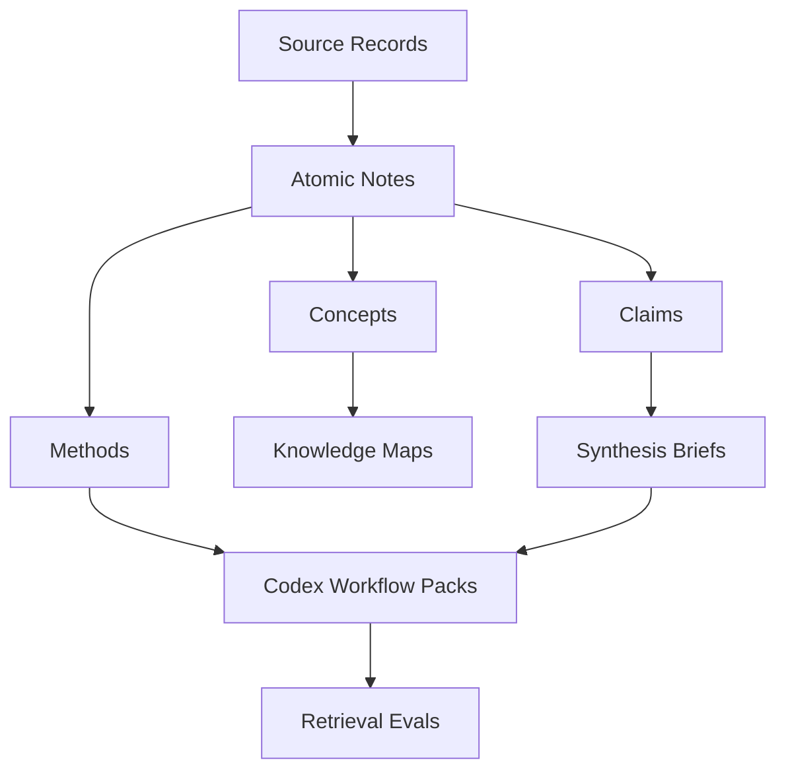

# General Knowledge Network

## Scope

This map describes the first-level structure of the knowledge base.

## Map

## Key Nodes

| Node | Meaning | Related entries |
| --- | --- | --- |
| Source Records | Traceable source metadata | `10-sources/` |
| Atomic Notes | Reusable smallest knowledge units | `20-notes/` |
| Knowledge Maps | Relationship views | `30-maps/` |
| Workflow Packs | Codex-facing procedures | `50-workflows/` |

## Open Questions

- Which domains should be seeded first?
- Which external search and paper sources should be automated first?
