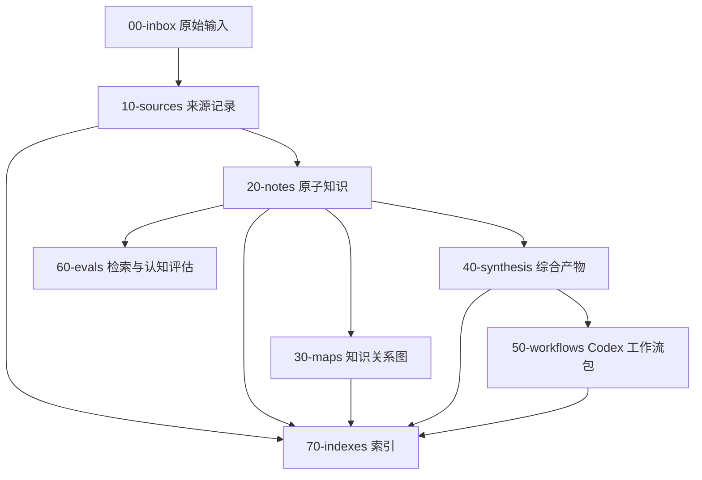

# 知识工程系统架构

## 设计目标

无界知识的根定位是知识工程系统。它采用“来源记录 + 原子知识 + 图谱关系 + 综合产物 + 工作流包 + 治理闭环”的结构，让外部知识进入、被结构化、被验证、被检索、被 Codex 调用，并通过审查、诊断和 loop 持续回流。

机器真相见 `system/project-ontology.json`；本文只做人类说明。

## 分层模型

## 关键对象

### Project Ontology

项目根定位描述“无界知识到底是什么”。它把系统治理、知识内容、机器基础设施、Canvas 可视化和 Codex 工作流放在同一个知识工程系统里，而不是拆成一个抽象系统和一个并列业务。

### Source Record

来源记录描述“信息从哪里来”。论文、GitHub 仓库、网页、个人经验都应该先变成来源记录，再进入原子知识层。

### Atomic Note

原子知识描述一个可复用判断、概念、方法、模式或风险。它必须足够小，方便在未来项目里被精确检索。

### Knowledge Map

知识地图描述概念之间的关系，而不是堆叠内容。适合用 Mermaid、表格和链接组织。

### Synthesis

综合产物回答更高层的问题，例如“某技术路线是否成熟”“某行业的关键约束是什么”“某类系统的最佳工程实践是什么”。

### Workflow Pack

工作流包是给 Codex 使用的入口。它把知识条目转化成行动协议，例如调研、设计、评审、编码、测试、上线前检查。

## 未来扩展

- 向量索引：把 `20-notes/`、`40-synthesis/`、`50-workflows/` 切块后送入本地或云端 embedding store。
- 图数据库：把 `related`、`sources`、`domains`、`workflows` 转成可查询关系。
- 自动采集：周期性抓取 arXiv、Semantic Scholar、GitHub trending、release notes 和重要博客。
- Codex 项目挂载：在任意项目里通过索引文件和工作流包快速引入领域认知。
