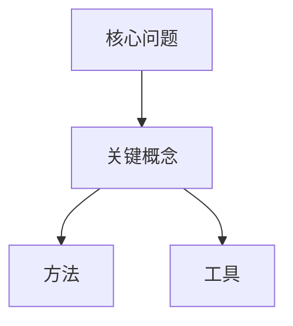

# {{title}}

## Scope

这个领域地图覆盖什么，不覆盖什么？

## Map

```mermaid
flowchart TD
    A["核心问题"] --> B["关键概念"]
    B --> C["方法"]
    B --> D["工具"]
```

## Key Nodes

| 节点 | 说明 | 相关条目 |
| --- | --- | --- |
|  |  |  |

## Open Questions

-
